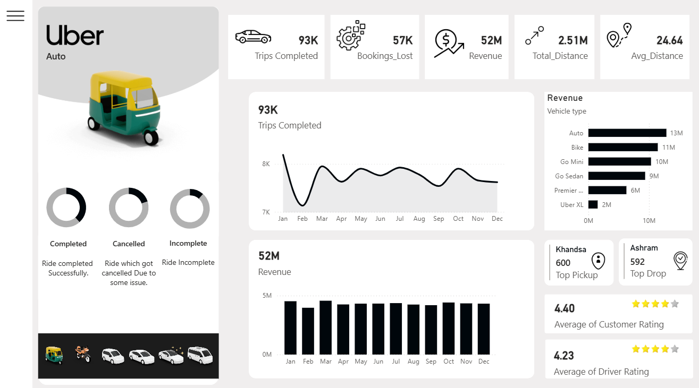
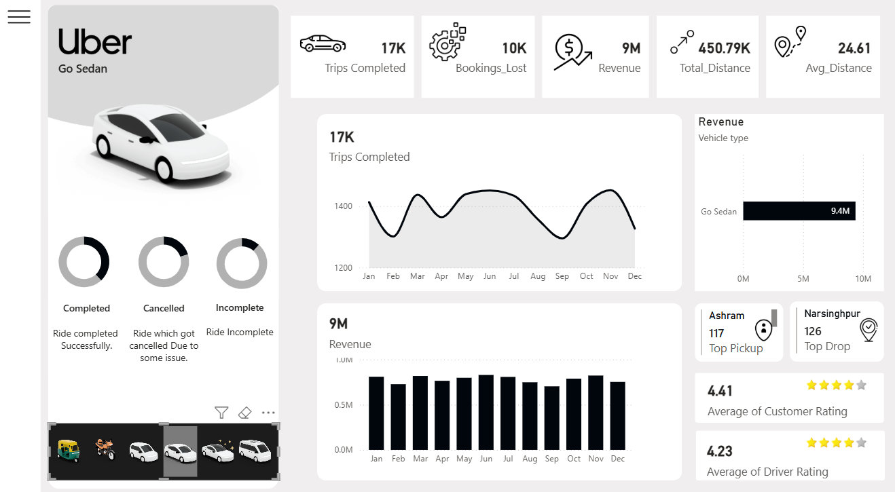

# 🚖 Uber Data Analytics Dashboard – Power BI

## 📊 Project Overview
This **Power BI Dashboard** provides a comprehensive analysis of Uber's operational and financial performance.  
It focuses on key metrics like **bookings, revenue, distance traveled,** and **customer/driver ratings** to uncover performance insights.

The main goal of this project was to convert **raw ride-sharing data** into meaningful, actionable business intelligence.  
It helps stakeholders monitor efficiency, evaluate top-performing vehicle types, and locate high-demand pickup and drop-off areas.

**🛠 Tool Used:** Microsoft Power BI Desktop  

---

## 📸 Dashboard Preview

### 🔹 Filtered View (Vehicle Type Example)

---

## 🎯 Business Requirements & Analysis Goals

### 1️⃣ Overview Page
Includes major **KPIs (Key Performance Indicators)**:
- Completed Bookings  
- Lost Bookings  
- Total Revenue  
- Total Distance  
- Average Distance  

### 2️⃣ Filters and Interactivity
- Added **Vehicle Type Filter** (e.g., Auto, Bike, Sedan, SUV, etc.)  
- Enables dynamic updates across visuals.  

### 3️⃣ Monthly Analysis
- **Bookings Completed** (Monthly Trend)  
- **Revenue Generated** (Monthly Trend)  

### 4️⃣ Quarterly Analysis
- **Bookings Completed** (Quarterly Trend)  
- **Revenue Generated** (Quarterly Trend)  

### 5️⃣ Revenue Segmentation
- **Revenue by Vehicle Type** (Bar Chart / Treemap)  

### 6️⃣ Geospatial Insights
- **Top Pickup Locations**  
- **Top Drop Locations**  
(based on booking count)

### 7️⃣ Ratings
- **Average Rider Rating**  
- **Average Driver Rating**

---

## 🧮 Key Performance Indicators (KPIs)
| **Metric** | **Description** |
|-------------|-----------------|
| Completed Bookings | Total number of successfully completed rides. |
| Lost Bookings | Total number of cancelled or unfulfilled rides. |
| Total Revenue | Total income generated from completed rides. |
| Total Distance | Combined distance traveled by all vehicles. |
| Avg Distance | Average distance per completed ride. |
| Avg Rider Ratings | Average rating given by drivers to riders. |
| Avg Driver Ratings | Average rating given by riders to drivers. |

---

## 🚀 Getting Started

To explore the dashboard:
1. **Download the file:** Clone this repository or download the `Uber_Dashboard.pbix` file.  
2. **Install Power BI Desktop:** Make sure you have it installed.  
3. **Open the file:** Launch the `.pbix` file in Power BI Desktop.  
4. **Explore:** Interact with filters, slicers, and visuals.
